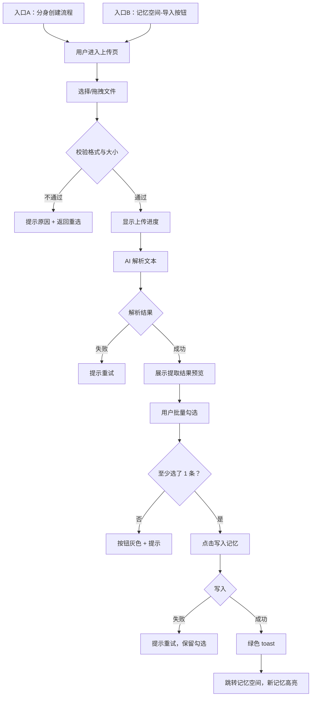

# 知识库上传 · AI 分身快速构建 — 完整 PRD

---

## 修改日志

| 版本 | 时间 | 修改内容 | 责任人 |
|------|------|---------|--------|
| v1 | 2026-05-20 | 初稿 | — |

---

## 一、问题陈述

**我是：** 一个已经用了这款 AI 社交 App 一段时间的用户。我每天跟分身聊天，期望它能逐渐了解我，但实际进展太慢。

**我想：** 让分身快速了解我的日常偏好和习惯——比如"奶茶不加冰""周末不想出门""聊到工作时别开玩笑"。

**但是：** 目前全靠日常对话中自然积累，分身需要 3 个月才能记住一个简单偏好。除了对话，没有别的方式能主动"喂"信息给分身。创建初期的几个标签根本概括不了我是谁。

**因为：** 对话学习天然慢——一次对话只聊一两件事，靠这个方式积累用户画像效率太低。而用户其实已经有很多现成的"关于我是谁"的数据，只是没有入口给分身。

**这让我感到：** 无奈——"我跟它聊了两个月了，它还问我喝什么"；懒得继续教——调教成本太高，开始放弃。

**最终问题陈述：** 用户需要一种**能主动、快速地让分身了解自己**的方式，因为纯靠对话自然积累太慢（简单偏好要数月），导致用户在分身"变懂自己"之前就失去耐心了。

**来源：** Elyse 用户反馈 + 竞品调研（市面产品均未做此功能）

---

## 二、产品定位

这是一个给 **AI 分身用户**用的 **App 内功能模块**，帮他们**通过上传文本文件批量输入个人信息，让分身快速了解自己**。

与现有方案相比，核心差异是：**用户不需要逐段手动粘贴——拖一个文件上去，AI 自动拆解写入记忆。**

---

## 三、产品形态与阶段策略

- **当前选型**：App 内功能模块
- **选择理由**：分身创建和调教都在 App 内完成，无需跳转外部工具
- **阶段策略**：MVP 支持文本文件（.txt / .md / .json / 备忘录导出），后续迭代加入截图 OCR
- **入口**：
  - 入口 A：分身创建流程中新增"上传文件"步骤
  - 入口 B：记忆空间中新增"导入"按钮
  - **策略：两个入口同步上线，不排优先级** ✅

---

## 四、目标用户

| 画像 | 场景 | 核心痛点 |
|------|------|---------|
| 新用户 | 初次创建分身，被逐项填写劝退 | 想一步到位，不想逐项填表 |
| 老用户（回流） | 用了几个月，分身进步太慢 | 对话积累等不起，想主动喂数据 |

---

## 五、产品价值

- **用户价值**：分身从"几个月才懂我"变为"上传完就懂"，调教从持续投入变成一次性操作
- **商业价值**：提升分身创建完成率（降低新用户流失  ▼）+ 提升老用户留存（给已冷却用户一个重新激活分身的理由 ▲）

---

## 六、核心用户动线



---

## 七、功能清单

```
知识库上传
├── 🔴 文件上传与校验
│   ├── 文件选择/拖拽
│   ├── 格式校验（.txt/.md/.json/备忘录导出）
│   └── 大小校验（上限 10MB）
├── 🔴 AI 解析引擎
│   ├── 文本内容提取
│   ├── 偏好/习惯/关系分类
│   └── 与已有记忆的冲突检测
├── 🔴 解析结果预览与批量确认
│   ├── 结果列表（默认全选，实时更新计数）
│   ├── 不确定项标记（?）
│   ├── 冲突项标记（橙色，点击展开详情）
│   └── 写入成功后 toast + 跳转
├── 🟡 双入口
│   ├── 分身创建流程中添加上传入口  ✅ 同步上线
│   └── 记忆空间中添加"导入"按钮     ✅ 同步上线
└── ⚪ 后续迭代
    ├── 截图 OCR 识别（聊天记录截图 → 文本提取）
    └── 支持更多文件格式（PDF/Word）
```

---

## 八、关键页面线框图 · 解析结果预览页

```
┌─────────────────────────┐
│  ← 返回    预览解析结果  │
├─────────────────────────┤
│  文件：聊天记录.txt       │
│  共解析出 12 条信息       │
│  ⚠️ 2 条与已有记忆重复已跳过│
├─────────────────────────┤
│                         │
│  ☑️ 偏好：奶茶不加冰      │
│  ☑️ 习惯：周末不爱出门    │
│  ☑️ 偏好：不喜欢雨天      │
│  ☐ 关系：有一个哥哥      │
│  ☑️ 习惯：睡前刷手机      │
│  🟠 不喜欢雨天 [冲突]    │
│  ⁉️️ 偏好：喜欢喝咖啡 [?] │
│  ...                    │
│                         │
├─────────────────────────┤
│  已选 4 条  →  [写入记忆] │
└─────────────────────────┘
```

交互规则：
- 默认全选，取消勾选时实时更新底部计数
- 全不选时"写入记忆"按钮灰色不可点，提示"请至少选择 1 条信息"
- 橙色行点击展开冲突详情
- "?" 标记的 tooltip："AI 不确定这条是否准确，建议手动确认"

---

## 九、功能详细描述

### 9.1 文件上传与校验

| 项目 | 内容 |
|------|------|
| **功能描述** | 用户选择本地文本文件上传，系统校验格式和大小后传给 AI 解析 |
| **触发条件** | 用户点击入口 A 或入口 B 的"上传文件"按钮 |

**交互细节：**

| 场景 | 处理方式 |
|------|---------|
| 操作反馈 | 选择文件后显示文件名+大小；点击上传后显示进度条 |
| 危险操作确认 | 无需 |
| 操作失败 | 格式不符→"仅支持 .txt/.md/.json 文件"；超大小→"文件不能超过 10MB，当前 X MB" |

**状态清单：**

| 状态 | 触发条件 | UI 表现 | 用户可操作 |
|------|---------|---------|-----------|
| 默认 | 页面加载 | 上传区域+格式说明+按钮 | 选择/拖拽文件 |
| 已选 | 选了文件 | 文件名+大小+确认按钮 | 确认/取消 |
| 上传中 | 点击确认 | 进度条+百分比 | 取消 |
| 校验失败 | 格式/大小不符 | 红色提示+原因 | 重选 |
| 完成 | 上传成功 | 自动进入解析 | — |

**边界条件：**
- 0 字节文件 → 提示"文件无内容，请重新选择"
- 超 10MB → 提示上限，不发起上传
- 上传中途退出 → "上传将中断，是否退出？"
- 重复上传同一文件 → 不做去重

---

### 9.2 AI 解析引擎

| 项目 | 内容 |
|------|------|
| **功能描述** | 对上传的文本进行语义分析，提取偏好/习惯/关系三类信息，并与已有记忆做冲突检测 |
| **触发条件** | 文件上传完成后自动触发 |

**交互细节：**

| 场景 | 处理方式 |
|------|---------|
| 操作反馈 | 进度动画 + "正在理解你的文件..." + 预估剩余时间 |
| 操作失败 | 超时→"文件较大，是否继续等待？"；异常→"解析失败，请重试" |

**状态清单：**

| 状态 | 触发条件 | UI 表现 | 用户可操作 |
|------|---------|---------|-----------|
| 解析中 | 上传完成 | 进度动画+文案 | 取消 |
| 成功 | 提取完成 | 进入预览页 | — |
| 无有效信息 | 未提取出任何条目 | 提示+返回 | 重选文件 |
| 超时 | 超过 30 秒 | 提示等待/重试 | 继续等待/重试 |
| 失败 | AI 服务异常 | 红色提示+重试 | 重试 |

**冲突检测规则：**
- 新条目与已有记忆矛盾 → 标橙色，用户确认写入时覆盖旧记忆
- 新条目与已有记忆重复（相似度 > 90%）→ 不展示，结果顶部提示"X 条重复已跳过"

---

### 9.3 解析结果预览与批量确认

| 项目 | 内容 |
|------|------|
| **功能描述** | 用户查看解析结果，批量勾选确认后写入记忆，成功后跳转 |
| **触发条件** | AI 解析成功完成 |

**交互细节：**

| 场景 | 处理方式 |
|------|---------|
| 操作反馈 | 勾选实时更新计数；写入时按钮变灰+loading |
| 空状态 | 全不选 → 按钮灰色 + "请至少选择 1 条信息" |
| 失败 | "写入失败，请重试"，已勾选保留不清空 |

**状态清单：**

| 状态 | 触发条件 | UI 表现 | 用户可操作 |
|------|---------|---------|-----------|
| 预览 | 解析完成 | 列表+核选框（默认全选）+计数 | 勾选/取消/全选 |
| 全不选 | 取消所有勾选 | 按钮灰色+提示 | 重新勾选 |
| 写入中 | 点击写入 | 按钮loading+列表不可编辑 | 等待 |
| 成功 | 写入完成 | 绿色 toast"已成功写入 X 条记忆"+跳转 | — |
| 失败 | 接口异常 | 红色提示+重试 | 重试/返回 |

---

## 十、数据规范

| 字段名 | 类型 | 限制 | 必填 | 默认值 | 校验 |
|------|------|------|------|------|------|
| 上传文件 | file | ≤10MB | 是 | — | .txt/.md/.json |
| 解析条目 | object | ≤50 条/次 | 是 | — | — |
| 条目类型 | string | 偏好/习惯/关系 | 是 | — | 枚举 |
| 条目内容 | string | ≤200 字/条 | 是 | — | — |
| 置信度 | float | 0-1 | 是 | — | — |
| 是否冲突 | boolean | — | 否 | false | — |

---

## 十一、文案规范

**风格基调：** 亲切友好

| 场景 | 文案 |
|------|------|
| 上传页标题 | "上传文件，让分身更懂你" |
| 格式提示 | "支持 .txt / .md / .json 格式，不超过 10MB" |
| 解析中 | "正在理解你的文件..." |
| 上传按钮 | "选择文件" |
| 写入按钮 | "写入记忆" |
| 写入成功 | "已成功写入 X 条记忆" |
| 格式不符 | "仅支持 .txt / .md / .json 格式，请重新选择" |
| 文件过大 | "文件不能超过 10MB，你的文件大小为 X MB" |
| 无有效信息 | "未在文件中找到可写入的信息，换一个文件试试？" |
| 写入失败 | "写入失败，请重试。如问题持续出现，请联系我们" |
| 全不选提示 | "请至少选择 1 条信息" |
| 空状态（无导入记录） | "还没有导入记录，试试上传你的备忘录或聊天记录吧" |

---

## 十二、对旧逻辑的影响

| 影响范围 | 影响说明 | 处理方式 |
|---------|---------|---------|
| 记忆列表 | 新增记忆来源"文件导入"，列表需支持显示来源标签 | 记忆列表卡片增加一行来源标注，如"来自 聊天记录导入" |
| 记忆详情 | 导入的记忆可被编辑/删除，逻辑与手工添加的记忆一致 | 复用现有编辑/删除接口，不需要新开发 |
| 记忆总数 | 导入不设单独上限，受记忆总量上限约束 | 如总量超限，导入时提示"记忆空间不足，请先清理" |
| 已有记忆 | 导入不自动覆盖已有记忆，冲突项标橙色由用户手动确认 | 见 9.2 冲突检测规则 |
| 分身回复 | 新记忆写入后，分身应即时生效（下次对话中体现新偏好） | 需 AI 工程师确认：记忆写入后是否需要重新加载模型？ |
| 分身创建流程 | 在创建流程中插入新步骤，可能增加创建总时长 | 上传步骤设为可选——用户可以跳过，不影响原有创建路径 |

---

## 十三、埋点方案

> ⚠️ 公司如有埋点命名规范，以公司规范为准，下表为默认规范（模块_动作_对象）。

### 事件清单

| 事件名 | 触发时机 | 参数 | 参数说明 | 优先级 |
|--------|---------|------|---------|:---:|
| knowledge_upload_entry_click | 点击上传入口 | entry_from | "onboarding"(分身创建流程) / "memory"(记忆空间) | P0 |
| knowledge_file_select | 用户选择文件 | file_format, file_size_mb | 文件格式和大小 | P0 |
| knowledge_upload_start | 点击确认上传 | file_format, file_size_mb | 同上 | P0 |
| knowledge_upload_success | 上传完成 | file_format, file_size_mb, duration_ms | 上传耗时 | P0 |
| knowledge_upload_fail | 上传失败 | file_format, file_size_mb, error_type | 错误类型（格式/大小/网络/服务端） | P0 |
| knowledge_parse_start | 开始 AI 解析 | file_size_mb | 文件大小 | P0 |
| knowledge_parse_success | 解析完成 | items_count, duration_ms | 提取条目数、耗时 | P0 |
| knowledge_parse_fail | 解析失败 | error_type, duration_ms | 超时/服务异常 | P0 |
| knowledge_parse_empty | 解析无结果 | file_size_mb | 文件有内容但无有效信息 | P1 |
| knowledge_preview_view | 预览页曝光 | items_count, conflict_count | 条目总数、冲突数 | P0 |
| knowledge_preview_toggle | 勾选/取消勾选 | item_type, action | "偏好"/"习惯"/"关系", "check"/"uncheck" | P1 |
| knowledge_preview_edit | 编辑单条内容 | item_type | — | P1 |
| knowledge_write_click | 点击写入记忆 | selected_count | 最终选中条数 | P0 |
| knowledge_write_success | 写入成功 | selected_count, conflict_overwrite_count | 写入条数、覆盖冲突条数 | P0 |
| knowledge_write_fail | 写入失败 | selected_count, error_type | — | P0 |
| knowledge_upload_cancel | 上传/解析中途取消 | cancel_at | "upload"(上传中)/"parse"(解析中) | P1 |

### 公共参数

| 参数名 | 说明 |
|--------|------|
| user_id | 用户唯一标识 |
| platform | iOS / Android / Web |
| app_version | 客户端版本号 |
| session_id | 当前会话 ID |

### 核心漏斗

```
入口点击 → 文件选择 → 上传成功 → 解析成功 → 预览页曝光 → 点击写入 → 写入成功

每一步到下一步的转化率 = 该环节流失点
```

### 关键指标

| 指标 | 计算方式 |
|------|---------|
| 上传成功率 | knowledge_upload_success / knowledge_upload_start |
| 解析成功率 | knowledge_parse_success / knowledge_parse_start |
| 写入确认率 | knowledge_write_click / knowledge_preview_view |
| 端到端完成率 | knowledge_write_success / knowledge_upload_entry_click |
| 平均解析耗时 | knowledge_parse_success 的 duration_ms 均值 |

---

## 十四、不做什么（边界）

- ❌ 不做第三方平台账号绑定——涉及授权与隐私合规
- ❌ MVP 不做截图 OCR——后续迭代
- ❌ 不做视频/音频文件解析
- ❌ 不自动覆盖已有记忆——冲突项必须让用户手动确认
- ❌ 不做批量删除导入记忆的专属入口——导入后和普通记忆一样，在记忆列表逐条管理

### 敏感内容提醒
- 用户上传的文件如包含他人个人信息（聊天记录含对方姓名/手机号等），产品不做主动拦截
- 建议在文件选择后增加轻提示："请勿上传包含他人隐私信息的内容"

---

## 十五、待确认问题 ⚠️

| # | 问题 | 需要谁确认 | 
|----|------|----------|
| 1 | 文件大小上限 10MB 是否 OK？开发和后端需要评估 | 开发 |
| 2 | AI 解析 10MB 文件能否在 30 秒内完成？ | AI 工程师 |
| 3 | 解析出的条目上限 50 条是否合理？ | PM + AI 工程师 |
| 4 | 两个入口的资源排期——能否同步上线？ | 开发 |
| 5 | 解析结果预览页是否支持用户**编辑单条**内容再写入？（目前只设计了勾选） | PM |
| 6 | 导入的记忆是否需要标记**来源**（如"来自 聊天记录.txt 导入"）？ | PM + 设计 |
| 7 | 已写入的记忆能否即时生效（下次对话中分身是否自动感知新偏好）？ | AI 工程师 |
| 8 | 埋点命名是否需要遵循公司规范？找谁要？ | 数据团队 |

---

## 十六、如何看这份文档

| 角色 | 重点看 |
|------|--------|
| Mentor | 一至六（问题定位+价值+动线），十四（待确认问题） |
| 开发 | 七（功能清单），八至十（页面+功能细节+数据规范） |
| AI 工程师 | 九.2（解析引擎），十二（性能要求） |
| 设计师 | 八（线框图），十一（文案规范） |
| 数据/测试 | 第九至十（功能+数据），可以据此写测试用例和埋点 |
